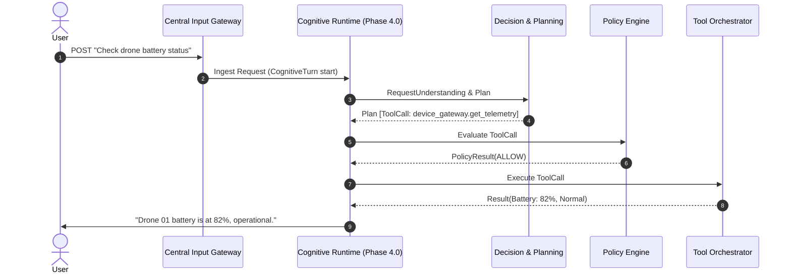
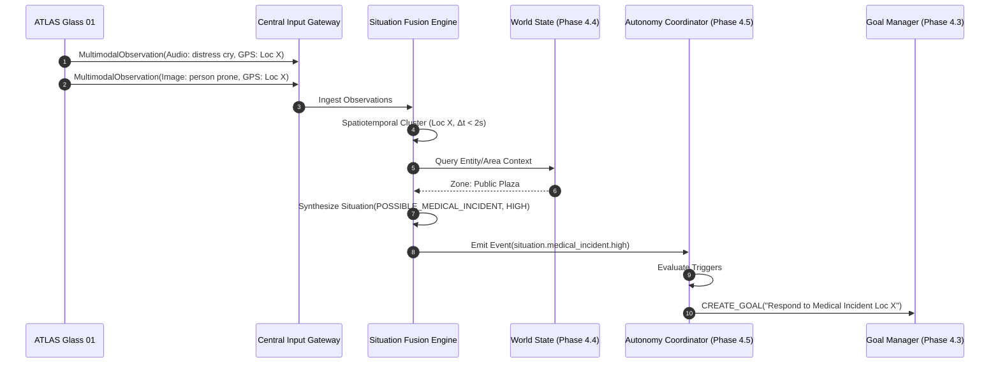
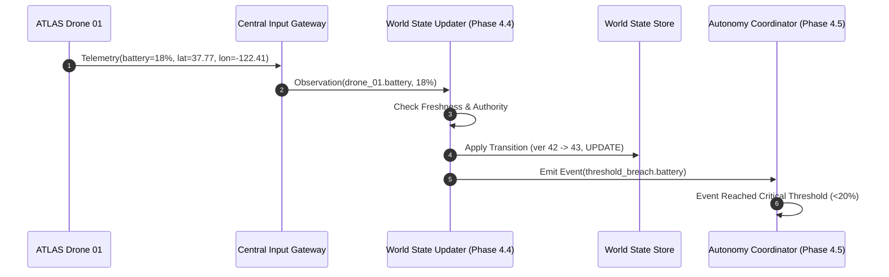
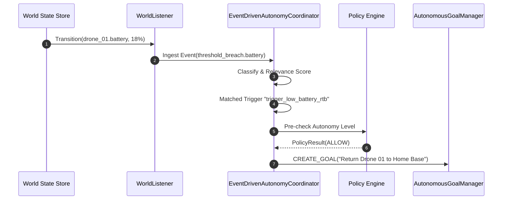
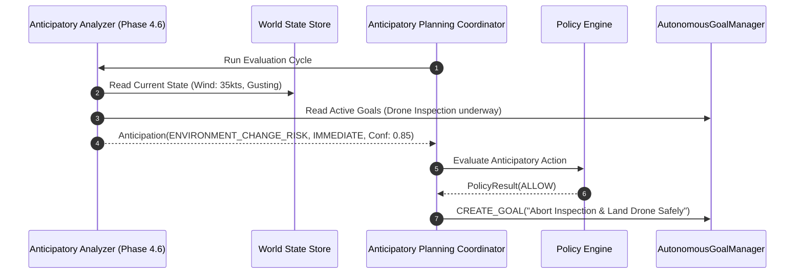
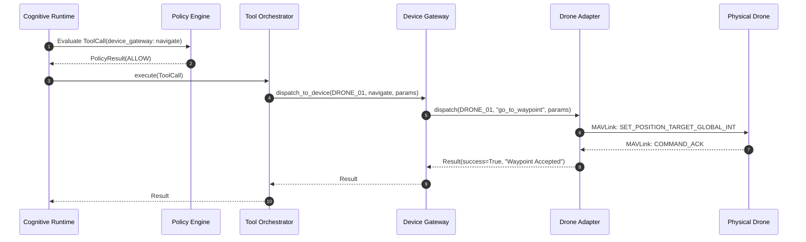
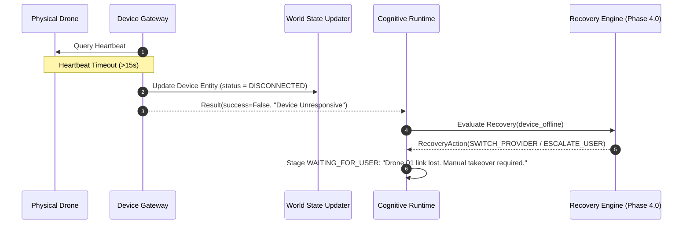
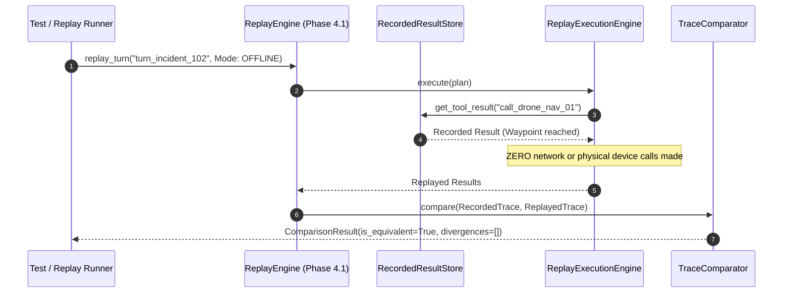

# ATLAS Phase 5.0 Architecture Design
## Central Orchestration Layer + Multimodal Situation Architecture

---

## 1. Executive Summary

ATLAS Phase 5.0 introduces the **Central Orchestration Layer** and **Multimodal Situation Architecture**, elevating the AI Control Center from a desktop-centric cognitive runtime (Phases 3.6–4.6) into a distributed, multi-agent, hardware-independent coordination brain. 

### Core Architectural Realization
The central system is the primary intelligence, deliberation, and policy authority. Edge participants—such as ATLAS Glass, autonomous drones, rovers, stationary sensor arrays, and microcontroller nodes (ESP32, Raspberry Pi)—are **edge participants and sensing/actuation nodes**, never the central deliberative brain. The Central Orchestration Layer operates purely at the semantic level of **observations, situations, entities, capabilities, goals, decisions, constraints, policies, and device identities**. It remains completely decoupled from physical transports, pin registers, PWM signals, UART baud rates, and vendor-specific edge protocols.

### Architectural Invariant
Phase 5.0 introduces **zero parallel engines**. It strictly reuses and composes the established foundations:
- **Phase 3.6**: Visual Grounding & Perception (`VisualScene`, `VisualElement`, `GroundingRequest`, `GroundedTarget`)
- **Phase 3.7**: Model-Neutral Multimodal Reasoning (`ReasoningRequest`, `ReasoningResponse`, `ActionProposal`, `ActionProposalValidator`)
- **Phase 3.8**: Model Router & Capability Registry (`ModelRequirements`, `ModelDescriptor`, `StandardModelRouter`)
- **Phase 4.0**: Unified Cognitive Runtime (`CognitiveRuntime`, `CognitiveStage`, `CognitiveTurn`, `CognitiveEvent`)
- **Phase 4.1**: Deterministic Replay & Observability (`ReplayEngine`, `TraceComparator`, `RecordedResultStore`)
- **Phase 4.2–4.3**: Long-Horizon & Autonomous Goal Management (`Goal`, `Objective`, `AutonomousGoalManager`, `GoalStore`)
- **Phase 4.4**: Persistent World State (`WorldState`, `WorldEntity`, `WorldCondition`, `DeterministicWorldStateUpdater`, `StateConflict`)
- **Phase 4.5**: Event-Driven Autonomy (`EventDrivenAutonomyCoordinator`, `Event`, `EventTrigger`, `DeterministicEventClassifier`)
- **Phase 4.6**: Proactive / Anticipatory Planning (`AnticipatoryPlanningCoordinator`, `Anticipation`, `EvidenceItem`)
- **Core Governance**: `StandardPolicyEngine`, `ToolOrchestrator`, and `ContextManager`

---

## 2. Current Architecture Reused

The existing ATLAS repository provides an exhaustive set of cognitive and governance primitives. Phase 5.0 reuses them without modification or duplication:

| Subsystem | Existing Phase & Module | Reused Concrete Abstractions | Phase 5.0 Composition Role |
| :--- | :--- | :--- | :--- |
| **Reasoning Engine** | Phase 3.7 (`backend/reasoning/`) | `ReasoningEngine`, `ActionProposalValidator`, `ReasoningRequest`, `ReasoningResponse`, `ActionProposal` | Sole reasoning authority; receives multimodal situation context; proposes governed actions. |
| **Model Router** | Phase 3.8 (`backend/routing/`) | `StandardModelRouter`, `ModelProviderRegistry`, `ModelRequirements`, `ModelDescriptor`, `ModelCapabilityType` | Selects optimal LLM/VLM provider matching situational requirements (text, vision, structured output). |
| **Visual Grounding** | Phase 3.6 (`backend/perception/`) | `PerceptionEngine`, `VisualSceneGrounder`, `VisualScene`, `VisualElement`, `BoundingBox`, `SpatialRelation` | Grounds spatial targets across computer displays, Glass viewports, and drone camera frames. |
| **Cognitive Runtime** | Phase 4.0 (`backend/runtime/`) | `CognitiveRuntime`, `CognitiveStage`, `CognitiveTurn`, `CognitiveEvent`, `CognitiveEventSinkInterface` | Governed execution lifecycle for all cognitive turns triggered by user or situational goals. |
| **Replay & Audit** | Phase 4.1 (`backend/runtime/`) | `ReplayEngine`, `ReplayExecutionEngine`, `ReplayPolicyEngine`, `RecordedResultStore`, `TraceComparator` | Bit-for-bit replay of historical incidents without contacting physical edge devices or networks. |
| **Goal Management** | Phase 4.2–4.3 (`backend/goals/`) | `GoalExecutionEngine`, `AutonomousGoalManager`, `GoalScheduler`, `GoalStore`, `Goal`, `Objective` | Decomposes high-level situation responses into schedulable, tracked multi-turn objectives. |
| **Persistent World State**| Phase 4.4 (`backend/world/`) | `DeterministicWorldStateUpdater`, `WorldStateStore`, `WorldState`, `WorldCondition`, `StateConflict`, `ConflictPolicy` | Single source of believed reality. Manages entities, conditions, freshness, and conflict resolution. |
| **Event-Driven Autonomy**| Phase 4.5 (`backend/autonomy/`) | `EventDrivenAutonomyCoordinator`, `DeterministicEventClassifier`, `DeterministicRelevanceEngine`, `Event`, `EventTrigger` | Evaluates situation-derived events and safely routes them to Goal Management (never direct tool execution). |
| **Anticipatory Planning**| Phase 4.6 (`backend/anticipation/`)| `AnticipatoryPlanningCoordinator`, `DeterministicAnticipatoryAnalyzer`, `Anticipation`, `EvidenceItem` | Evaluates emerging situations for forward-looking operational risks and mitigation goals. |
| **Policy Engine** | Core Governance (`backend/safety/`) | `StandardPolicyEngine`, `PolicyContext`, `PolicyDecision`, `PolicyResult`, `AutonomyLevel` | Authoritative gatekeeper for all tool calls, device actions, and autonomous actions. |
| **Tool Orchestration** | Core Governance (`backend/tools/`) | `ToolOrchestrator`, `CapabilityRegistry`, `Executor`, `ToolCall`, `Result` | Single execution boundary for capabilities; delegates to Device Gateway adapters. |
| **Context Management** | Core (`backend/context/`) | `ContextManager`, `CognitiveState`, `ContextSelection`, `ContextItem`, `AttentionFocus` | Bounded working set assembly for LLM/VLM prompts. |

---

## 3. Central Orchestration Layer Responsibilities

The Central Orchestration Layer is the central nervous system of ATLAS. Its strict boundaries are defined below:

```
                                  ATLAS CENTRAL ORCHESTRATION
┌──────────────────────────────────────────────────────────────────────────────────────────────┐
│                                                                                              │
│   [ Transport Agnostic Ingress ]                                                             │
│                 │                                                                            │
│                 ▼                                                                            │
│       CENTRAL INPUT GATEWAY ────► Enforces Auth, Rate Limits, Envelope Normalization          │
│                 │                                                                            │
│                 ▼                                                                            │
│       MULTIMODAL OBSERVATION ENVELOPE (Canonical Ingress Contract)                           │
│                 │                                                                            │
│        ┌────────┴────────────────────────┬──────────────────────────┐                        │
│        ▼                                 ▼                          ▼                        │
│  [Visual Modalities]            [Telemetry / Kinematics]   [Audio / Ambient Events]          │
│  Phase 3.6 Grounding            Phase 4.4 World Updater    Audio Feature Ingestion           │
│  (VisualScene / Elements)       (Entity Conditions)        (Acoustic Classifications)        │
│        └────────┬────────────────────────┴──────────────────────────┘                        │
│                 ▼                                                                            │
│       SITUATION FUSION ENGINE ──► Spatiotemporal Correlation, Evidence Graph, Conflict Eval   │
│                 │                                                                            │
│                 ▼                                                                            │
│             SITUATION ──────────► Multi-observation semantic interpretation                 │
│                 │                                                                            │
│        ┌────────┴────────────────────────┬──────────────────────────┐                        │
│        ▼                                 ▼                          ▼                        │
│  WORLD STATE UPDATE             AUTONOMY EVENT BUS         ANTICIPATION EVIDENCE             │
│  Phase 4.4 Store                Phase 4.5 Coordinator      Phase 4.6 Analyzer                │
│  (Believed Reality)             (Trigger Matching)         (Emerging Risk Hypotheses)        │
│        │                                 │                          │                        │
│        └────────────────────────┬────────┴──────────────────────────┘                        │
│                                 ▼                                                            │
│                     AUTONOMOUS GOAL MANAGER (Phase 4.3)                                      │
│                                 │                                                            │
│                                 ▼                                                            │
│                     COGNITIVE RUNTIME (Phase 4.0)                                            │
│                                 │                                                            │
│                                 ▼                                                            │
│                     POLICY ENGINE (Authoritative Gatekeeper)                                 │
│                                 │                                                            │
│                                 ▼                                                            │
│                     TOOL ORCHESTRATOR (Phase 2/3 Execution Boundary)                         │
│                                 │                                                            │
│                                 ▼                                                            │
│                     DEVICE / AGENT GATEWAY (Outbound Boundary)                               │
│                                 │                                                            │
└─────────────────────────────────┼────────────────────────────────────────────────────────────┘
                                  │ (Semantic Capability Commands: NAVIGATE, CAPTURE, HOVER)
                                  ▼
                    ┌───────────────────────────┐
                    │       EDGE ADAPTERS       │
                    │ (MAVLink, ROS2, WebRTC)   │
                    └─────────────┬─────────────┘
                                  │ (Protocols: Serial, UDP, WiFi, BLE)
                                  ▼
                    ┌───────────────────────────┐
                    │     EDGE PARTICIPANTS     │
                    │ (Glass, Drone, Rover, Pi) │
                    └───────────────────────────┘
```

### Central Responsibilities:
1. **Normalization**: Ingest heterogeneous telemetry, sensor frames, video, audio events, and user requests via a unified, transport-independent envelope (`MultimodalObservation`).
2. **Perception Grounding**: Direct visual and spatial sensory streams into Phase 3.6 perceptual grounding to yield coordinate-referenced elements.
3. **Situation Synthesis**: Correlate multi-sensor evidence across space, time, and entity boundaries into structured `Situation` models.
4. **State Maintenance**: Update Phase 4.4 `WorldState` atomically via `DeterministicWorldStateUpdater` with strict freshness and conflict checking.
5. **Autonomy Dispatch**: Emit Phase 4.5 `Event`s when situations cross priority or safety thresholds, letting `EventDrivenAutonomyCoordinator` govern goal creation.
6. **Anticipatory Assessment**: Feed situations into Phase 4.6 `AnticipatoryPlanningCoordinator` as `EvidenceItem`s to preempt resource exhaustion or mission failure.
7. **Governed Decision-Making**: Pass all deliberative tasks through Phase 4.0 `CognitiveRuntime`, Phase 3.7 `ReasoningEngine`, and Phase 3.8 `StandardModelRouter`.
8. **Policy Enforcement**: Route every proposed physical or computational action through `StandardPolicyEngine`.
9. **Hardware-Agnostic Capability Dispatch**: Dispatch semantic actions (e.g., `navigate`, `capture_telemetry`, `track_target`) to registered device adapters via the `DeviceGateway`.

### Non-Responsibilities (What Central NEVER Does):
- Never executes low-level device control loops (e.g., PID motor stabilization, brushless ESC PWM signaling, camera sensor gain control).
- Never speaks hardware transport protocols directly (no raw serial, MAVLink packet framing, or GPIO bitbanging).
- Never bypasses `StandardPolicyEngine` or `ToolOrchestrator` to invoke devices.
- Never directly mutates `WorldState` without going through `DeterministicWorldStateUpdater`.
- Never treats unconfirmed hypotheses or situations as ground-truth facts.

---

## 4. Edge Layer Responsibilities

Edge devices are smart peripheral participants operating under central direction.

### Edge Device Classes
1. **ATLAS Glass**:
   - **Onboard Sensors**: RGB video camera, microphone array, IMU, 9-DOF motion tracking, GPS receiver, display HUD.
   - **Local Preprocessing**: Edge voice activity detection (VAD), wake-word detection, local frame downsampling/H.264 compression, gaze/motion estimation, sensor timestamp synchronization.
   - **Upstream Role**: Streams packaged `MultimodalObservation` envelopes to the Central Input Gateway.
   - **Downstream Role**: Displays HUD notifications, navigation cues, and visual overlays rendered from central capability instructions.
2. **Autonomous Drone (e.g., PX4 / ArduPilot via Companion Computer)**:
   - **Onboard Processing**: Real-time flight stabilization, optical flow obstacle avoidance, companion computer (e.g., Raspberry Pi 5 / Jetson Orin Nano) running edge adapter.
   - **Upstream Role**: Transmits periodic kinematic telemetry (GPS, altitude, battery percentage, heading, pitch/roll, velocity) and tagged image captures.
   - **Downstream Role**: Translates central `NAVIGATE`, `TAKEOFF`, `LAND`, `HOVER`, and `RETURN_TO_HOME` capability invocations into vehicle MAVLink commands.
3. **Autonomous Rover (e.g., ROS2 / Micro-ROS node)**:
   - **Onboard Processing**: Wheel odometry, 2D LiDAR collision avoidance, motor driver control.
   - **Upstream Role**: Transmits environmental telemetry (odometry, obstacle proximity vectors, battery state).
   - **Downstream Role**: Translates central waypoint directives into ROS2 `NavigateToPose` actions.
4. **Sensor / Actuator Nodes (ESP32 / Microcontrollers)**:
   - **Onboard Processing**: ADC sampling, threshold debouncing, MQTT/Serial heartbeat reporting.
   - **Upstream Role**: Periodic or interrupt-driven telemetry (temperature, gas detection, contact switch).

### Edge Invariants
- Edge devices possess local safety reflexes (e.g., drone auto-lands on radio loss or critical battery; rover stops on immediate bumper collision).
- Edge devices **never plan multi-turn missions or orchestrate other devices**. Mission authority remains 100% central.

---

## 5. Multimodal Architecture

Multimodal inputs must enter ATLAS Central through a unified, coherent pipeline that leverages Phase 3.6 and Phase 3.7 without duplicating perception logic.

```
Incoming Stream (Glass Video, Drone Camera, Mic Array, GPS Telemetry)
                           │
                           ▼
                 Central Input Gateway
                           │ (Packaging & Attribution)
                           ▼
                 MultimodalObservation
                           │
         ┌─────────────────┼─────────────────┐
         ▼                 ▼                 ▼
   IMAGE / FRAME         AUDIO             KINEMATICS / SENSOR
         │                 │                 │
         ▼                 │                 ▼
Phase 3.6 Perception       │         Phase 4.4 World Updater
- OCRProvider              │         (Observed Conditions)
- CVProvider               ▼                 │
- Accessibility    Audio Event Extractor     │
         │         (Distress, Siren, Crash)  │
         ▼                 │                 │
   VisualScene             ▼                 ▼
   (Grounded Elements)  AudioFeatureItem   WorldCondition
         │                 │                 │
         └─────────────────┼─────────────────┘
                           ▼
                Situation Fusion Engine
```

### Modality Ingestion Matrix

| Modality Type | Ingested Form | Central Processing Path | Produced Structured Representation |
| :--- | :--- | :--- | :--- |
| **TEXT** | UTF-8 String | Direct to `RequestUnderstanding` / `CognitiveRuntime` | `Request`, `CognitiveTurn` |
| **VOICE / AUDIO** | Audio PCM chunk or Edge Audio Event Tag | Central Whisper/STT + Audio Classifier | Transcribed Text `Request` + `AudioEvent` |
| **IMAGE / FRAME** | JPEG/PNG file path or memory buffer ref | Phase 3.6 `PerceptionEngine` (`cv_provider`, `ocr_provider`) | `VisualScene` with `VisualElement`s & `BoundingBox` |
| **GPS / LOCATION** | WGS-84 Lat/Lon/Alt + Accuracy radius | Normalized Geo-Spatial Evaluator | Spatial coordinates in `WorldCondition` / `Situation` |
| **TELEMETRY** | Structured Key-Value Dictionary | Phase 4.4 `DeterministicWorldStateUpdater` | `WorldCondition`, `StateProvenance` |
| **DEVICE STATE** | State enum (IDLE, ACTIVE, CHARGING, ERROR) | Device Registry + World State Updater | `WorldEntity` attribute update |
| **USER ACTION** | Touch, Gaze dwell, Button press | Direct Ingress Event | User `Observation` / `Event` |

---

## 6. Observation Contract (`MultimodalObservation`)

The `MultimodalObservation` envelope is the primary ingress contract for all external and edge-generated data. It generalizes the Phase 4.4 entity-level `Observation` while remaining 100% convertible to it.

```python
from dataclasses import dataclass, field
from enum import Enum
from typing import Any, Dict, Optional, Tuple

class ModalityType(str, Enum):
    TEXT = "text"
    VOICE_TRANSCRIPT = "voice_transcript"
    AUDIO_EVENT = "audio_event"
    IMAGE = "image"
    VIDEO_FRAME = "video_frame"
    GPS = "gps"
    TELEMETRY = "telemetry"
    DEVICE_STATE = "device_state"
    WORLD_STATE = "world_state"
    EVENT = "event"
    USER_ACTION = "user_action"

@dataclass(frozen=True)
class GeoLocation:
    latitude: float
    longitude: float
    altitude_meters: Optional[float] = None
    accuracy_meters: float = 1.0

    def distance_to(self, other: "GeoLocation") -> float:
        """Great-circle Euclidean approximation for local spatial clustering."""
        import math
        dlat = math.radians(other.latitude - self.latitude)
        dlon = math.radians(other.longitude - self.longitude)
        a = (math.sin(dlat / 2) ** 2 +
             math.cos(math.radians(self.latitude)) *
             math.cos(math.radians(other.latitude)) *
             math.sin(dlon / 2) ** 2)
        c = 2 * math.atan2(math.sqrt(a), math.sqrt(1 - a))
        return 6371000.0 * c  # Earth radius in meters

@dataclass(frozen=True)
class MultimodalObservation:
    """
    Unified central ingress contract for all observations entering ATLAS.
    Immutable, provenance-preserving, and transport-independent.
    """
    observation_id: str
    source_id: str                   # e.g., 'ATLAS_GLASS_01', 'DRONE_01', 'USER_01'
    source_type: str                 # 'glass', 'drone', 'rover', 'sensor', 'user', 'service'
    modality: ModalityType
    timestamp: float                 # Epoch timestamp (UTC seconds)
    payload: Any                     # Modality-specific payload or typed metadata
    confidence: float = 1.0          # [0.0, 1.0]
    location: Optional[GeoLocation] = None
    device_id: Optional[str] = None  # Canonical device identifier if generated by device
    correlation_id: Optional[str] = None
    causation_id: Optional[str] = None
    artifact_ref: Optional[str] = None # File path or store hash for heavy blobs (images/audio)
    expires_at: Optional[float] = None
    metadata: Dict[str, Any] = field(default_factory=dict)

    def __post_init__(self):
        if not self.observation_id:
            raise ValueError("MultimodalObservation observation_id must be non-empty.")
        if not self.source_id:
            raise ValueError("MultimodalObservation source_id must be non-empty.")
        if not (0.0 <= self.confidence <= 1.0):
            raise ValueError(f"Confidence must be in [0.0, 1.0], got {self.confidence}")
        if self.timestamp <= 0.0:
            raise ValueError(f"Timestamp must be positive, got {self.timestamp}")

    def is_fresh(self, now: float, max_age_seconds: float = 30.0) -> bool:
        if self.expires_at is not None and now >= self.expires_at:
            return False
        return (now - self.timestamp) <= max_age_seconds

    def to_world_state_observation(self, entity_id: str, property_name: str, value: Any) -> "Observation":
        """
        Convert to Phase 4.4 Observation for direct ingestion by DeterministicWorldStateUpdater.
        """
        from core.models.world_state import Observation
        return Observation(
            observation_id=self.observation_id,
            source_id=self.source_id,
            source_type=self.source_type,
            timestamp=self.timestamp,
            entity_id=entity_id,
            property_name=property_name,
            value=value,
            confidence=self.confidence,
            expires_at=self.expires_at,
            metadata={
                **self.metadata,
                "modality": self.modality.value,
                "correlation_id": self.correlation_id,
                "artifact_ref": self.artifact_ref,
            },
        )
```

---

## 7. Situation Model (`Situation`)

A **Situation** represents an intermediate semantic interpretation synthesized from multiple related observations, world facts, and signals occurring within a shared context.

### Semantic Distinctions
- **A Situation is NOT a World State Fact**: It is an interpretive hypothesis of aggregate context (e.g., `POSSIBLE_MEDICAL_INCIDENT`), whereas World State records verified entities and conditions (e.g., `person_01.vital_status = "distressed"`).
- **A Situation is NOT an Action or Tool Call**: It represents *what is happening*, not *what command to run*.
- **A Situation is NOT a Goal**: It provides the situational predicate that can motivate goal creation, but does not specify completion criteria or decomposition.

```python
class SituationCategory(str, Enum):
    SECURITY_ALERT = "security_alert"
    SAFETY_HAZARD = "safety_hazard"
    MEDICAL_INCIDENT = "medical_incident"
    SYSTEM_DEGRADATION = "system_degradation"
    ENVIRONMENTAL_CHANGE = "environmental_change"
    MISSION_MILESTONE = "mission_milestone"
    ROUTINE_MONITORING = "routine_monitoring"
    UNKNOWN = "unknown"

class SituationSeverity(str, Enum):
    INFO = "info"
    LOW = "low"
    MEDIUM = "medium"
    HIGH = "high"
    CRITICAL = "critical"

class SituationStatus(str, Enum):
    EMERGING = "emerging"       # Initial evidence gathered; awaiting corroboration
    ACTIVE = "active"           # Corroborated and active
    RESOLVED = "resolved"       # Conditions returned to normal
    INVALIDATED = "invalidated" # Subsequent evidence contradicted the interpretation
    DISMISSED = "dismissed"     # Operator or policy dismissed

@dataclass(frozen=True)
class SituationEvidence:
    """Explicit provenance reference for evidence contributing to a Situation."""
    evidence_id: str
    observation_id: str
    source_id: str
    modality: ModalityType
    weight: float              # Contribution weight [0.0, 1.0]
    timestamp: float
    summary: str

@dataclass(frozen=True)
class Situation:
    """
    Model-neutral representation of a fused situational context.
    Auditable, provenance-preserving, and immutable.
    """
    situation_id: str
    category: SituationCategory
    title: str
    description: str
    severity: SituationSeverity
    confidence: float                                   # Fused confidence [0.0, 1.0]
    status: SituationStatus
    involved_entity_ids: Tuple[str, ...]                # Entities referenced in World State
    evidence: Tuple[SituationEvidence, ...]             # Corroborating observation provenance
    location: Optional[GeoLocation] = None
    created_at: float = 0.0
    updated_at: float = 0.0
    validity_window_seconds: float = 300.0             # Max duration before re-evaluation
    correlation_id: str = ""
    causation_id: Optional[str] = None
    related_event_ids: Tuple[str, ...] = field(default_factory=tuple)
    related_goal_ids: Tuple[str, ...] = field(default_factory=tuple)
    metadata: Dict[str, Any] = field(default_factory=dict)

    def is_expired(self, now: float) -> bool:
        return (now - self.updated_at) > self.validity_window_seconds

    def to_autonomy_event(self) -> "Event":
        """
        Convert this situation into a Phase 4.5 autonomy Event for policy/trigger evaluation.
        """
        from core.models.autonomy import Event, EventSource, EventPriority, EventProvenance
        prio_map = {
            SituationSeverity.INFO: EventPriority.LOW,
            SituationSeverity.LOW: EventPriority.LOW,
            SituationSeverity.MEDIUM: EventPriority.NORMAL,
            SituationSeverity.HIGH: EventPriority.HIGH,
            SituationSeverity.CRITICAL: EventPriority.CRITICAL,
        }
        return Event(
            event_id=f"evt_sit_{self.situation_id}",
            source=EventSource.EXTERNAL,
            event_type=f"situation.{self.category.value}.{self.severity.value}",
            priority=prio_map.get(self.severity, EventPriority.NORMAL),
            timestamp=self.updated_at,
            payload={
                "situation_id": self.situation_id,
                "category": self.category.value,
                "severity": self.severity.value,
                "confidence": self.confidence,
                "involved_entity_ids": list(self.involved_entity_ids),
                "location": {
                    "lat": self.location.latitude,
                    "lon": self.location.longitude,
                } if self.location else None,
            },
            provenance=EventProvenance(
                source_id=f"situation_engine:{self.situation_id}",
                source_type=EventSource.EXTERNAL,
                origin_timestamp=self.created_at,
                correlation_id=self.correlation_id,
                depth=0,
            ),
            correlation_id=self.correlation_id,
            deduplication_key=f"sit:{self.category.value}:{','.join(sorted(self.involved_entity_ids))}",
        )
```

---

## 8. Situation Fusion Architecture

The **Situation Fusion Engine** deterministically aggregates incoming `MultimodalObservation` instances into active `Situation` representations.

```
Incoming MultimodalObservations
             │
             ▼
┌──────────────────────────────────────────────┐
│        SITUATION FUSION ENGINE               │
│                                              │
│ 1. Spatiotemporal Clustering                 │
│    - Time Window: [t - Δt, t]                │
│    - Geo Distance: ≤ R meters                │
│                                              │
│ 2. Entity & Topic Correlation                │
│    - Common entity_id or contextual tags     │
│                                              │
│ 3. Contradiction & Conflict Resolution       │
│    - Reuses Phase 4.4 ConflictPolicy         │
│    - Source Authority & Confidence Weighting │
│                                              │
│ 4. Fused Confidence & Severity Synthesis     │
│    - Bayesian / Weighted Evidence Sum        │
│                                              │
│ 5. Situation Lifecycle Management            │
│    - Emerging ──► Active ──► Resolved        │
│    - Invalidation on contradictory evidence  │
└──────────────────────┬───────────────────────┘
                       ▼
            Active Situations Cache
                       │
         ┌─────────────┴─────────────┐
         ▼                           ▼
Phase 4.4 WorldState        Phase 4.5 Autonomy Event
(Fact Updates)              (Trigger Evaluation)
```

### Fusion Principles & Conflict Handling
1. **Temporal Clustering**: Observations arriving within a configurable rolling window (default: 30.0s) with intersecting spatial coordinates or identical target entity IDs are grouped as candidate evidence.
2. **Spatial Clustering**: If observations carry `GeoLocation`, they must be within spatial tolerance (default: 50.0m) to associate with an outdoor incident.
3. **Contradiction Management (World State Integration)**:
   - Example: Vision reports `person_fallen = True (conf: 0.72)`; Radar/Depth reports `no_obstruction = True (conf: 0.90)`.
   - The engine does *not* blindly select the most recent input.
   - It delegates to Phase 4.4 `DeterministicConflictResolver` and `ConflictPolicy` using explicit source authorities (e.g., Radar/LiDAR has higher authority for range; High-res Vision has higher authority for classification).
   - If unresolved, the situation confidence is penalized and marked `AMBIGUOUS_EVIDENCE`, triggering a Phase 3.7 `ReasoningRequest` or Phase 4.2 re-observation objective rather than an aggressive physical dispatch.
4. **Lifecycle Transitions**:
   - `EMERGING`: Single uncorroborated high-severity observation (e.g., audio distress sound alone).
   - `ACTIVE`: Corroborated by secondary modality (e.g., camera visual grounding confirms prone human figure, or GPS confirms match).
   - `INVALIDATED`: Contradictory evidence of higher authority arrives.
   - `RESOLVED`: Telemetry or camera shows normal condition restored.

---

## 9. Device / Agent Identity

Devices and external agents must be represented as central entities distinct from transport connections.

```python
class DeviceType(str, Enum):
    GLASS = "glass"
    DRONE = "drone"
    ROVER = "rover"
    SENSOR_STATION = "sensor_station"
    VIRTUAL_SIMULATOR = "virtual_simulator"
    EDGE_COMPUTE = "edge_compute"

class ConnectivityStatus(str, Enum):
    CONNECTED = "connected"
    DEGRADED = "degraded"       # High latency or packet loss
    DISCONNECTED = "disconnected"
    UNRESPONSIVE = "unresponsive"

@dataclass(frozen=True)
class DeviceCapabilityDescriptor:
    """Declaration of a discrete capability supported by an edge device."""
    capability_name: str        # e.g., 'navigate', 'capture_image', 'hover', 'display_hud'
    action_name: str            # e.g., 'go_to_waypoint', 'snap_still', 'stream_h264'
    parameters_schema: Dict[str, Any]
    is_reversible: bool = False
    requires_confirmation: bool = False
    rate_limit_per_minute: int = 60

@dataclass(frozen=True)
class DeviceIdentity:
    """
    Central representation of an authenticated, registered edge participant.
    """
    device_id: str                      # Canonical ID: 'ATLAS_DRONE_01', 'ATLAS_GLASS_01'
    device_type: DeviceType
    display_name: str
    firmware_version: str
    capabilities: Tuple[DeviceCapabilityDescriptor, ...]
    home_location: Optional[GeoLocation] = None
    is_simulation: bool = False
    registered_at: float = 0.0
    last_heartbeat_at: float = 0.0
    status: ConnectivityStatus = ConnectivityStatus.CONNECTED
    metadata: Dict[str, Any] = field(default_factory=dict)

    def has_capability(self, capability: str, action: str) -> bool:
        cap_clean = capability.strip().lower()
        act_clean = action.strip().lower()
        return any(
            c.capability_name.lower() == cap_clean and c.action_name.lower() == act_clean
            for c in self.capabilities
        )
```

---

## 10. Capability Model & ToolOrchestrator Integration

Phase 5.0 reuses the existing `ToolOrchestrator` and `CapabilityRegistry` architecture. We do **NOT** build a parallel execution path.

### How Device Actions become Governed ToolCalls
A high-level decision to command a drone or rover is represented as a canonical Phase 2 `ToolCall`:

```python
# Canonical ToolCall representation of a device action
tool_call = ToolCall(
    capability="device_gateway",
    action="dispatch_capability",
    parameters={
        "device_id": "ATLAS_DRONE_01",
        "capability": "navigate",
        "action": "go_to_location",
        "parameters": {
            "latitude": 37.7749,
            "longitude": -122.4194,
            "altitude_meters": 15.0,
            "speed_mps": 5.0,
        },
        "constraints": {
            "battery_minimum": 25.0,
            "max_duration_seconds": 120.0,
        }
    },
    reason="Deploy drone to investigate possible incident location",
    call_id="call_drone_nav_01"
)
```

### End-to-End Governance Pipeline
```
Reasoning Engine / Goal Execution Engine
                 │
                 ▼
          ActionProposal
                 │
                 ▼
       ActionProposalValidator (Phase 3.7)
                 │
                 ▼
             ToolCall
                 │
                 ▼
         ToolOrchestrator (Phase 2/3)
                 │
                 ├── 1. Validation against allowed capabilities
                 │
                 ├── 2. StandardPolicyEngine.evaluate(tool_call, context)
                 │      [Checks AutonomyLevel, RiskLevel, Device Authorization]
                 │
                 ├── 3. CapabilityRegistry.get_executor("device_gateway")
                 │
                 ▼
      DeviceGatewayExecutor
                 │
                 ▼
       Target Device Adapter (e.g. DroneAdapter)
                 │
                 ▼
       Physical / Simulated Vehicle
```

---

## 11. Device / Agent Gateway

The **Device Gateway** provides the strict abstraction boundary between central governance and edge communication protocols.

```
                            CENTRAL LAYER
                                  │
                                  ▼
                        DeviceGatewayService
                                  │
         ┌────────────────────────┼────────────────────────┐
         ▼                        ▼                        ▼
  DroneDeviceAdapter       GlassDeviceAdapter       RoverDeviceAdapter
         │                        │                        │
         ▼                        ▼                        ▼
   MAVLink / UDP            WebRTC / WSS             ROS2 / Zenoh
         │                        │                        │
         ▼                        ▼                        ▼
  Physical Drone            ATLAS Glass            Physical Rover
```

### Gateway Interface Contracts

```python
class DeviceAdapterInterface(ABC):
    """Protocol-specific edge adapter contract."""
    
    @abstractmethod
    def get_supported_device_type(self) -> DeviceType:
        pass

    @abstractmethod
    def dispatch(self, device_id: str, action: str, parameters: Dict[str, Any]) -> Result:
        """Translate central semantic action into protocol frames and await ack."""
        pass

    @abstractmethod
    def query_status(self, device_id: str) -> Dict[str, Any]:
        """Poll or read cached transport state."""
        pass

class DeviceGatewayInterface(ABC):
    """Authoritative central gateway managing all edge device adapters."""

    @abstractmethod
    def register_device(self, identity: DeviceIdentity) -> None:
        pass

    @abstractmethod
    def unregister_device(self, device_id: str) -> None:
        pass

    @abstractmethod
    def register_adapter(self, device_type: DeviceType, adapter: DeviceAdapterInterface) -> None:
        pass

    @abstractmethod
    def dispatch_to_device(
        self,
        device_id: str,
        capability: str,
        action: str,
        parameters: Dict[str, Any],
        timeout_seconds: float = 10.0,
    ) -> Result:
        pass
```

---

## 12. Multimodal Reasoning Integration (Phase 3.7 / 3.8)

When situational uncertainty requires semantic evaluation, the Central Orchestration Layer constructs an explicit Phase 3.7 `ReasoningRequest` and routes it through Phase 3.8 `StandardModelRouter`.

### Deciding WHAT Information to Supply
The Central Layer never passes raw sensor dumps. It dynamically tailors the `ReasoningRequest` based on the situation:
- **Spatial Incident**: Supplies `visual_scene` (from Phase 3.6 `PerceptionEngine`) + `grounded_candidates` + `world_conditions` (location, weather, battery).
- **Audio/Sensor Alarm**: Supplies `task_description` + recent `evidence` + `world_conditions`.
- **Text User Request**: Supplies `goal` + conversation `history`.

### Model Routing via Phase 3.8
The Central Layer never hardcodes provider names (e.g. `gpt-4o`, `qwen-2.5-vl`, `claude-3-5-sonnet`). It formulates `ModelRequirements`:

```python
requirements = ModelRequirements(
    required_capabilities=(
        ModelCapabilityType.VISION,
        ModelCapabilityType.STRUCTURED_OUTPUT,
    ),
    preferred_capabilities=(
        ModelCapabilityType.TOOL_REASONING,
    ),
    locality_requirement=LocalityRequirement.CLOUD_ALLOWED,
    privacy_class=PrivacyClass.ORGANIZATION_INTERNAL,
)

routing_result = model_router.route(requirements)
# Resolves deterministically to configured provider
```

---

## 13. Context Integration (`ContextManager`)

Phase 5.0 reuses Phase 3.9 `ContextManager` without creating duplicate context managers.

### Context Composition Path
To support Situations, `ContextSource` is extended cleanly with `ContextSource.SITUATION`:

```python
# ContextItem generated from active Situation
situation_item = ContextItem(
    item_id=f"ctx_sit_{situation.situation_id}",
    source=ContextSource.SITUATION,
    content=f"Active Situation: {situation.title} [{situation.severity.value.upper()}]. "
            f"Confidence: {situation.confidence:.2f}. Involved Entities: {', '.join(situation.involved_entity_ids)}. "
            f"Description: {situation.description}",
    relevance=0.95,
    priority=ContextPriority.HIGHEST if situation.severity in (SituationSeverity.HIGH, SituationSeverity.CRITICAL) else ContextPriority.HIGH,
    recency=situation.updated_at,
    confidence=situation.confidence,
    is_protected=True, # Prevent pruning when budgeting
)
```

`CognitiveState` is instantiated with active world conditions and situation items, passed into `ContextManager.build_context()`, which applies `ContextBudget` rules to generate the bounded `ContextSelection`.

---

## 14. World State Integration (Phase 4.4)

The Phase 4.4 `WorldState` remains the **single authoritative source of believed reality**.

### Interaction Flow
1. **Observations Ingress**: Telemetry or sensor readings arriving via `MultimodalObservation` are converted to Phase 4.4 `Observation` objects and submitted to `DeterministicWorldStateUpdater.apply_observation()`.
2. **Atomic Transitions**: If accepted, a `WorldStateTransition` (ADD, UPDATE) increments `WorldState.version` monotonically.
3. **State Conflicts**: If an observation contradicts existing conditions, Phase 4.4 `DeterministicConflictResolver` applies `ConflictPolicy` to determine winning provenance or record an unresolved `StateConflict`.
4. **Situation Context**: The `SituationFusionEngine` reads current `WorldState` snapshots to link observations to known entities (e.g., `ATLAS_DRONE_01`, `ZONE_A`, `USER_01`).
5. **Invariant**: `Situation` hypotheses are **never** injected directly as `WorldCondition` facts. Only corroborated factual outcomes become conditions.

---

## 15. Event Integration (Phase 4.5)

Phase 4.5 `EventDrivenAutonomyCoordinator` evaluates autonomous system behavior.

### Situation-to-Event Translation
When a `Situation` is formed, updated, or escalates in severity, `situation.to_autonomy_event()` emits a strongly typed `Event` with `source=EventSource.EXTERNAL` and `event_type="situation.<category>.<severity>"`.

### Autonomous Routing Boundary
- `EventDrivenAutonomyCoordinator.ingest_event(event)`:
  - Classifies event priority and category without LLM.
  - Scores relevance against active goals and world state.
  - Evaluates registered `EventTrigger` rules.
  - Produces an `AutonomyDecision` (e.g., `CREATE_GOAL`, `UPDATE_GOAL`, `ESCALATE_TO_USER`).
- **CRITICAL INVARIANT**: The Event system **never** directly dispatches a device command. It strictly dispatches into Phase 4.3 `AutonomousGoalManager`.

---

## 16. Anticipation Integration (Phase 4.6)

Phase 4.6 `AnticipatoryPlanningCoordinator` anticipates future-oriented operational risks.

### Feeding Situations into Anticipation
Situations serve as first-class `EvidenceItem` records for forward-looking analysis:

```python
evidence_item = EvidenceItem(
    evidence_id=f"ev_sit_{situation.situation_id}",
    source_type=EvidenceSourceType.WORLD_STATE,
    source_id=situation.situation_id,
    description=f"Persistent situation: {situation.title} (severity: {situation.severity.value})",
    confidence=situation.confidence,
    observed_at=situation.updated_at,
    expires_at=situation.updated_at + situation.validity_window_seconds,
    metadata={"situation_category": situation.category.value},
)
```

`DeterministicAnticipatoryAnalyzer` evaluates these evidence items against active goals. For example:
- Active Goal: `Inspect Pipeline Sector 4 via Drone 01`
- Situation Evidence: `Battery Drain Rate Accelerated (drone_01.battery = 18%)`
- Resulting Anticipation: `FutureConditionType.RESOURCE_DEPLETION_RISK` with `TimeHorizon.IMMEDIATE`.
- Action: `AnticipatoryDecisionType.CREATE_GOAL` -> Creates goal `Return Drone 01 to Charging Pad`.

---

## 17. Goal Integration (Phases 4.2 & 4.3)

Goals represent desired future states pursued across multiple turns.

### Situation-Driven Goal Instantiation
When a critical situation warrants autonomous intervention, the `AutonomousGoalManager` instantiates a Phase 4.2 `Goal`:
1. `original_goal`: `"Investigate and mitigate possible medical incident at Sector 7"`
2. `constraints`: `GoalConstraints(allowed_capabilities=("device_gateway", "web", "memory"), max_turns_total=10, autonomy_level="autonomous")`
3. `objectives`:
   - `Obj 1`: Dispatch Drone 01 to waypoint Sector 7 (`device_gateway:navigate`).
   - `Obj 2`: Capture high-resolution visual imagery (`device_gateway:capture_image`).
   - `Obj 3`: Verify human presence and status via Phase 3.6 visual grounding.
   - `Obj 4`: Alert emergency services if distress confirmed (`policy_engine:require_confirmation`).
4. `GoalExecutionEngine` schedules objectives sequentially, dispatching turns through the `CognitiveRuntime`.

---

## 18. Cognitive Runtime Integration (Phase 4.0)

Every cognitive decision turn triggered by a goal objective executes through the unified Phase 4.0 `CognitiveRuntime`.

### Turn Lifecycle with Multimodal Situation Context
```
RECEIVED ──► UNDERSTANDING ──► DECISION ──► PLANNING ──► CONTEXT ──► ROUTING ──►
REASONING ──► PROPOSAL ──► VALIDATION ──► POLICY ──► EXECUTION ──► OBSERVATION ──►
VERIFICATION ──► (RECOVERY) ──► MEMORY ──► RESPONSE ──► COMPLETED
```
- **Context Stage**: Injects `ContextSource.SITUATION` items.
- **Routing Stage**: Uses `StandardModelRouter` to select vision/multimodal models.
- **Execution Stage**: Dispatches governed `ToolCall` via `ToolOrchestrator` to `DeviceGateway`.
- **Observation Stage**: Awaits device execution acknowledgment and telemetry.
- **Verification Stage**: Verifies whether physical state changed as expected (e.g., drone reached waypoint).

---

## 19. Policy Integration (`StandardPolicyEngine`)

The Central Orchestration Layer **MUST NOT** become a policy authority. `StandardPolicyEngine` remains the sole, authoritative gatekeeper.

### Policy Rules for Edge Devices
The policy engine enforces explicit constraints before any device command executes:
1. **Autonomy Level Check**:
   - `MANUAL`: Device actions strictly forbidden without direct user prompt.
   - `ASSISTED`: Device movement allowed; destructive or high-risk actions require user confirmation.
   - `AUTONOMOUS`: Governed device actions allowed within predefined spatial/safety bounds.
2. **Safety Geofencing**:
   - Drone navigation commands must fall within verified operating corridors.
   - Prohibited zones (e.g. airports, power lines) result in policy `DENY`.
3. **Critical Battery Rules**:
   - If battery condition < 20%, non-return navigation commands are denied with `DENY`.
4. **Confirmation Triggers**:
   - External alerts, physical sirens, or emergency broadcasts require `PolicyDecision.REQUIRE_CONFIRMATION`.

---

## 20. Replay Integration (Phase 4.1)

All central orchestration messages, situation decisions, and device capability requests must be **100% compatible with the Phase 4.1 Replay Engine**.

### Non-Negotiable Replay Invariants
During offline or simulation replay:
1. **Zero Device Contact**: `ReplayExecutionEngine` intercepts all `device_gateway` capability calls and returns recorded responses from `RecordedResultStore`.
2. **Zero Network Traffic**: No remote APIs, WebSockets, or MAVLink packets are transmitted.
3. **Zero Production Mutation**: Replay uses `ReplayMemoryService` and an isolated world state store, never mutating live SQLite memory or active WorldState.
4. **Divergence Detection**: `TraceComparator` compares replayed situation decisions and tool calls against the recorded baseline to pinpoint cognitive drifts.

---

## 21. Correlation & Provenance Architecture

Every action, situation, and observation maintains an unbroken, audit-reconstructible chain:

```
MultimodalObservation (observation_id)
        │
        ▼
Situation (situation_id)
        │
        ▼
Autonomy Event (event_id)
        │
        ▼
Anticipation (anticipation_id)
        │
        ▼
Goal (goal_id)
        │
        ▼
Objective (objective_id)
        │
        ▼
Cognitive Turn (turn_id)
        │
        ▼
ActionProposal (proposal_id)
        │
        ▼
ToolCall (call_id)
        │
        ▼
Device Dispatch Result (result_id)
        │
        ▼
Resulting MultimodalObservation (observation_id_next)
```

Every model maintains `correlation_id` (identifying the overarching operational scenario) and `causation_id` (identifying the immediate parent entity).

---

## 22. Security Boundaries

Distributed edge participants introduce distinct attack surfaces:
1. **Device Authentication**: Mutual TLS (mTLS) or HMAC-SHA256 token authentication for all gateway transport connections.
2. **Message Authenticity & Integrity**: All incoming `MultimodalObservation` envelopes must bear a valid device signature or gateway token.
3. **Replay Attack Protection**: Timestamp freshness checks (reject observations with `|now - timestamp| > 30s`) and monotonically increasing device message sequence numbers.
4. **Capability Scoping**: A device identity is locked to its declared capability whitelist (e.g., Glass cannot issue drone flight commands).
5. **Tamper Containment**: Compromised edge devices are marked `ConnectivityStatus.DISCONNECTED` and their authority is zeroed in `ConflictPolicy`.

---

## 23. Failure Handling

The central layer is designed to fail safely under all edge and computational anomalies:

| Failure Mode | Detection Mechanism | Handling Strategy |
| :--- | :--- | :--- |
| **Device Offline / Lost Link** | Heartbeat timeout (>15s) | Device status set to `DISCONNECTED`; world state updated; ongoing goals targeting device transitioned to `BLOCKED`; recovery triggered. |
| **Stale Telemetry** | `MultimodalObservation.is_fresh() == False` | Telemetry rejected at Input Gateway; world condition freshness transitioned to `STALE` or `EXPIRED`. |
| **Malformed Observation** | Pydantic / dataclass validation error | Dropped at Gateway ingress; security audit event logged; no crash. |
| **Conflicting Observations** | `DeterministicConflictResolver` conflict detection | `StateConflict` recorded; resolution policy evaluated; ambiguity flag raised if unresolved. |
| **Model Unavailable** | `StandardModelRouter` reports routing failure | Fails closed; turn status set to `WAITING_FOR_USER` or aborts safely without unauthorized actions. |
| **Device Capability Error** | Device returns error code or timeout | `Result(success=False)`; Phase 4.0 Recovery Engine evaluates retry, alternative device, or user escalation. |
| **Policy Denial** | `StandardPolicyEngine` returns `DENY` | Execution halted; audit log emitted; goal objective marked `FAILED` with policy reason. |

---

## 24. Simulation Architecture

To support end-to-end testing without physical hardware, the architecture specifies a first-class **Simulation Mode**:
1. **Virtual Participants**: `VirtualGlass`, `VirtualDrone`, and `VirtualRover` implement the identical message envelopes and device capabilities.
2. **Transparent Ingress**: The `CentralInputGateway` accepts simulated observations without knowing or caring whether the origin is a real PX4 drone or a software flight simulator (e.g., Gazebo / AirSim / Mock).
3. **Simulation Device Adapters**: `SimulationDroneAdapter` simulates flight dynamics, telemetry degradation, and battery consumption deterministically.

---

## 25. API & Message Contract Proposal

### Inbound Endpoint: POST `/api/v1/gateway/observations`
```json
{
  "observation_id": "obs_glass_982341",
  "source_id": "ATLAS_GLASS_01",
  "source_type": "glass",
  "modality": "video_frame",
  "timestamp": 1773045600.12,
  "confidence": 0.88,
  "location": {
    "latitude": 37.77492,
    "longitude": -122.41941,
    "altitude_meters": 2.1,
    "accuracy_meters": 0.8
  },
  "artifact_ref": "/storage/frames/2026/09/09/frame_982341.jpg",
  "correlation_id": "corr_patrol_04",
  "metadata": {
    "detected_tags": ["person_prone", "sidewalk"]
  }
}
```

### Outbound Gateway Command: Internal `dispatch_capability`
```json
{
  "dispatch_id": "cmd_drone_0091",
  "device_id": "ATLAS_DRONE_01",
  "capability": "navigate",
  "action": "go_to_waypoint",
  "parameters": {
    "latitude": 37.77492,
    "longitude": -122.41941,
    "altitude_meters": 12.0,
    "velocity_mps": 4.0
  },
  "constraints": {
    "timeout_seconds": 60.0,
    "min_battery_percent": 25.0
  },
  "correlation_id": "corr_patrol_04"
}
```

---

## 26. Component Dependency Graph

```
[Edge Devices: Glass, Drone, Rover]
                 │
                 ▼
     [Central Input Gateway]
                 │
                 ▼
    [Situation Fusion Engine] ◄────────┐
                 │                     │
        ┌────────┴────────┐            │
        ▼                 ▼            │
 [World State Store] [Autonomy Bus]    │
  (Phase 4.4)         (Phase 4.5)      │
        │                 │            │
        └────────┬────────┘            │
                 ▼                     │
    [Autonomous Goal Manager]          │
        (Phase 4.2 / 4.3)              │
                 │                     │
                 ▼                     │
       [Cognitive Runtime] ────────────┤
           (Phase 4.0)                 │ (Telemetry Ingestion)
                 │                     │
                 ▼                     │
         [Policy Engine]               │
         (Safety / Policy)             │
                 │                     │
                 ▼                     │
       [Tool Orchestrator]             │
        (Phase 2 / 3)                  │
                 │                     │
                 ▼                     │
      [Device / Agent Gateway]         │
                 │                     │
                 ▼                     │
     [Edge Protocol Adapters] ─────────┘
```

---

## 27. Sequence Diagrams

### Scenario 1: User Text Request


### Scenario 2: Glass Image + Audio + GPS Incident


### Scenario 3: Drone Telemetry Update


### Scenario 4: World State Event Triggers Autonomy


### Scenario 5: Anticipatory Risk Becomes a Goal


### Scenario 6: Central Decision Sends Capability Request to Device


### Scenario 7: Device Fails / Goes Offline


### Scenario 8: Replay of an Autonomous Incident


---

## 28. Existing Abstractions Reused

| Component | Status | Source Path | Notes |
| :--- | :--- | :--- | :--- |
| `VisualScene`, `VisualElement`, `BoundingBox` | **REUSE** | `backend/core/models/perception.py` | Authoritative visual grounding model |
| `GroundingRequest`, `GroundedTarget` | **REUSE** | `backend/core/models/perception.py` | Target resolution models |
| `ReasoningRequest`, `ReasoningResponse` | **REUSE** | `backend/core/models/reasoning.py` | Bounded model reasoning contracts |
| `ActionProposal`, `ActionProposalValidator`| **REUSE** | `backend/core/models/reasoning.py` | Propose-validate separation |
| `StandardModelRouter`, `ModelRequirements` | **REUSE** | `backend/routing/router.py` | Model-neutral provider routing |
| `CognitiveRuntime`, `CognitiveStage` | **REUSE** | `backend/runtime/cognitive_runtime.py`| Control plane execution lifecycle |
| `ReplayEngine`, `ReplayExecutionEngine` | **REUSE** | `backend/runtime/replay_engine.py` | Deterministic incident replay |
| `WorldState`, `WorldCondition`, `Observation`| **REUSE** | `backend/core/models/world_state.py` | Single source of believed reality |
| `DeterministicWorldStateUpdater` | **REUSE** | `backend/world/updater.py` | State update boundary |
| `Event`, `EventTrigger`, `AutonomyDecision` | **REUSE** | `backend/core/models/autonomy.py` | Autonomous event routing |
| `EventDrivenAutonomyCoordinator` | **REUSE** | `backend/autonomy/coordinator.py` | Event evaluation authority |
| `Anticipation`, `EvidenceItem` | **REUSE** | `backend/core/models/anticipation.py`| Forward-looking hypotheses |
| `AnticipatoryPlanningCoordinator` | **REUSE** | `backend/anticipation/coordinator.py`| Proactive planning evaluation |
| `StandardPolicyEngine`, `PolicyContext` | **REUSE** | `backend/safety/policy_engine.py` | Authoritative policy evaluator |
| `ToolOrchestrator`, `CapabilityRegistry` | **REUSE** | `backend/tools/tool_orchestrator.py` | Governed execution boundary |
| `ContextManager`, `CognitiveState` | **REUSE** | `backend/context/context_manager.py` | Working set context assembly |

---

## 29. New Abstractions Required

| Proposed Abstraction | Architectural Category | Primary Purpose | Justification |
| :--- | :--- | :--- | :--- |
| `MultimodalObservation` | **NEW** (Domain Model) | Normalized multi-modality ingress envelope | Generalizes Phase 4.4 `Observation` across visual, audio, and kinematic payloads. |
| `GeoLocation` | **NEW** (Domain Value Object) | Immutable WGS-84 coordinate model | Standardizes spatial location across Glass, drones, rovers, and world entities. |
| `Situation` | **NEW** (Domain Model) | Fused semantic interpretation model | Crucial intermediate state between raw observations and actionable goals. |
| `SituationEvidence` | **NEW** (Domain Model) | Explicit provenance link for situation facts | Reconstructible audit trail for situation synthesis. |
| `SituationFusionEngine` | **NEW** (Core Service) | Spatiotemporal & entity clustering engine | Deterministic aggregation of multimodal streams into situations. |
| `DeviceIdentity` | **NEW** (Domain Model) | Central model of registered edge participant | Decouples device capabilities and identity from transport protocols. |
| `DeviceCapabilityDescriptor` | **NEW** (Domain Model) | Schema declaration for edge actions | Allows dynamic capability discovery and policy validation. |
| `CentralInputGatewayInterface` | **NEW** (Interface) | Transport-independent ingress boundary | Decouples HTTP/WS/gRPC transports from central processing. |
| `DeviceGatewayInterface` | **NEW** (Interface) | Central boundary for outbound edge commands | Shields central system from hardware/edge protocols. |
| `DeviceAdapterInterface` | **ADAPTER ONLY** | Protocol-specific translation contract | Translates central capability calls to MAVLink, ROS2, WebRTC, etc. |

---

## 30. Duplicate / Overlap Audit

To enforce the mandate of zero parallel engines:

- **No Second Reasoning Engine**: Multimodal situation reasoning calls `StandardReasoningEngine` and `StandardModelRouter`.
- **No Second World State**: Situations reference `WorldStateStore`; factual observations update `WorldState` via `DeterministicWorldStateUpdater`.
- **No Second Event Bus**: Situations emit Phase 4.5 `Event` instances into `EventDrivenAutonomyCoordinator`.
- **No Second Goal Manager**: Situational response objectives are submitted directly to `AutonomousGoalManager`.
- **No Second Policy Authority**: Device dispatches strictly pass through `StandardPolicyEngine`.
- **No Second Tool Orchestrator**: Device actions are implemented as standard capabilities registered in `CapabilityRegistry`.
- **No Second Context Manager**: Situations are formatted as `ContextItem` with `source=ContextSource.SITUATION`.
- **No Second Replay System**: Gateway calls during replay are answered by `ReplayExecutionEngine` via `RecordedResultStore`.

---

## 31. Implementation Sequence & Roadmap

1. **Milestone 5.0a — Core Contracts & Domain Models**:
   - Define `MultimodalObservation`, `GeoLocation`, `Situation`, `SituationEvidence`, `DeviceIdentity`, `DeviceCapabilityDescriptor`.
   - Implement conversion methods to Phase 4.4 `Observation` and Phase 4.5 `Event`.
2. **Milestone 5.0b — Situation Fusion Engine**:
   - Implement spatiotemporal clustering algorithms.
   - Integrate with Phase 4.4 `DeterministicConflictResolver` for contradictory evidence.
3. **Milestone 5.0c — Central Input Gateway**:
   - Implement transport-agnostic normalization pipeline, rate limiters, and authentication checks.
4. **Milestone 5.0d — Device Gateway & Simulation Adapters**:
   - Implement `DeviceGatewayInterface` and `DeviceGatewayService`.
   - Register `"device_gateway"` capability in `ToolOrchestrator` and `CapabilityRegistry`.
   - Build `VirtualDroneAdapter`, `VirtualGlassAdapter`, `VirtualRoverAdapter` for mock simulation testing.
5. **Milestone 5.0e — Cross-Layer Integration & Replay Compatibility**:
   - Wire Situations to `EventDrivenAutonomyCoordinator` and `AnticipatoryPlanningCoordinator`.
   - Add replay recording and simulation fixtures to `ReplayEngine`.
   - Write comprehensive end-to-end integration tests.

---

## 32. Architectural Risks & Mitigations

1. **Risk: Sensor Telemetry Ingress Flood**: High-frequency telemetry (e.g. 50Hz IMU/GPS) can overwhelm central queues.
   - *Mitigation*: Edge preprocessing filters high-frequency noise; Central Input Gateway enforces per-source rate limiting and deadband thresholding.
2. **Risk: Spurious Situation Escalations**: Noisy sensory inputs causing false emergency alarms.
   - *Mitigation*: Multimodal corroboration required before `SituationStatus.ACTIVE` is granted; high-impact actions mandate human confirmation via `StandardPolicyEngine`.
3. **Risk: Cascade Loops between Situations and Goals**: Situation triggers Goal -> Goal execution triggers Observation -> Observation triggers Situation.
   - *Mitigation*: Bounded cascade depth (`depth <= 3`) inherited from Phase 4.5 provenance and duplicate suppression windows.

---

## 33. Open Architectural Questions

1. **Spatial Coordinate System**: WGS-84 GPS is ideal for outdoors; indoor Glass/Rover tracking may require relative SLAM local metric coordinates (x, y, z relative to anchor). The `GeoLocation` model can be extended with a local frame reference.
2. **Video Streaming Architecture**: Low-latency video frames (Glass/Drone) should pass through an out-of-band WebRTC media plane, sending keyframe snapshots or feature embeddings into the Central Gateway rather than raw 60fps video packets.

---

## 34. Final Verdict

### **ARCHITECTURE APPROVED**

The Phase 5.0 Central Orchestration Layer + Multimodal Situation Architecture specification is complete, robust, hardware-independent, and rigorously adheres to all architectural boundaries, reuse mandates, and policy governance rules of the ATLAS ecosystem.
